# Omarchy Umbra

**Knowledge that works when nothing else does.**

Omarchy Umbra puts **Umbra Wiki**, an offline survival assistant, one click
away in your [Omarchy](https://omarchy.org) bar, next to your coding agents.
Umbra Wiki is a local AI that answers from a library stored on your own
computer, cites its sources, and keeps working with no internet, no account
and no subscription. Nothing you ask leaves your machine.

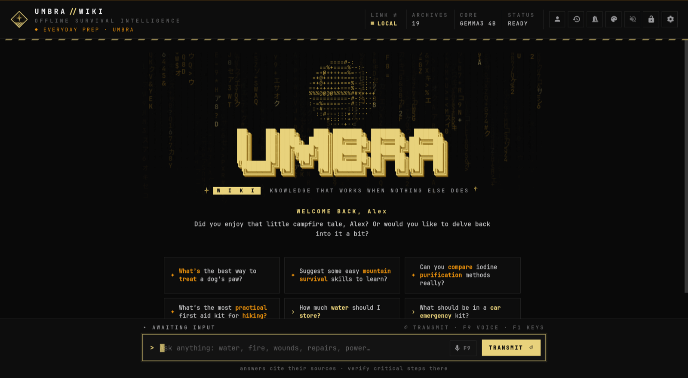

- **Offline and private**: a local AI (through Ollama) reads from offline
  field manuals, medical guides and repair libraries on your disk.
- **Answers you can check**: every answer cites its sources, and a built-in
  field manual covers the critical basics.
- **Made to be lived with**: scenarios and personalities, a welcome tour,
  history, voice input, 22 themes, animated backgrounds and transitions, and
  an off-grid battery saver.
- **Runs on Omarchy and on any Arch Linux**: the bar widget is Omarchy's;
  Umbra Wiki itself runs anywhere on Arch.

---

## Contents

- [Umbra Wiki](#umbra-wiki)
- [The bar widget](#the-bar-widget)
- [Install](#install)
- [First launch: the welcome tour](#first-launch-the-welcome-tour)
- [Requirements and speed](#requirements-and-speed)
- [Privacy and security](#privacy-and-security)
- [Keyboard shortcuts](#keyboard-shortcuts)
- [Update, reset, uninstall](#update-reset-uninstall)
- [Troubleshooting](#troubleshooting)
- [How it works](#how-it-works)
- [Safety](#safety)
- [Credits and license](#credits-and-license)

---

## Umbra Wiki

### Answers you can check

Ask anything in plain words. Umbra searches its offline library and its field
manual, then answers in the voice of the personality you picked, with
numbered citations. Hover a citation for a summary; click it to read the page
itself. Umbra usually ends with an offer ("If you like, I can…"). Under an
answer, buttons open the tool that fits (the CPR metronome, a field manual
page, the map…), and Umbra knows its own features, so you can simply ask it
what it can do. Press **Tab** in the empty prompt for **quick actions**: a
small menu with likely replies, the fitting tools and, on the start screen,
questions to start with.

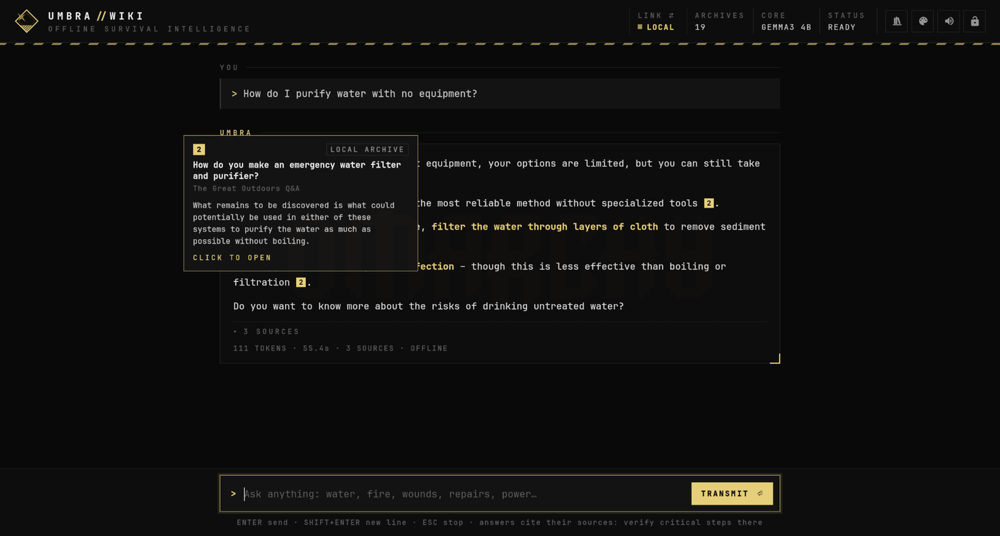

While it thinks, a little ASCII scene that fits your scenario plays next to
a rotating field note, and Umbra's working lines keep you company. Answers
take about a minute on an ordinary laptop, because everything runs on your
own computer.

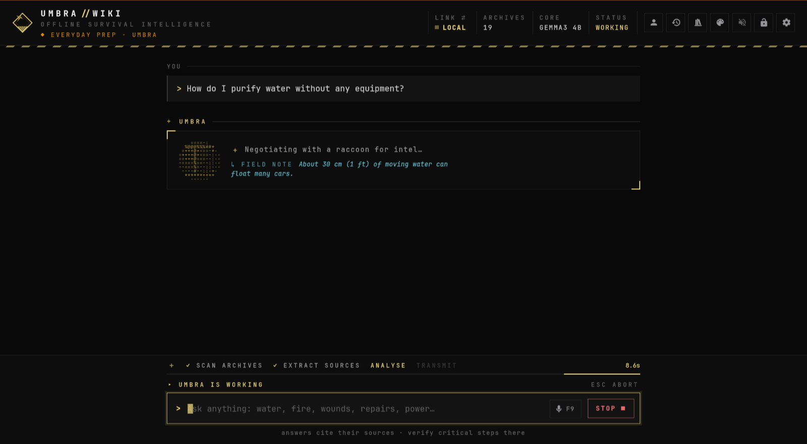

Every conversation reads as one long page: scroll up (even while Umbra is
still writing) to reread, all the way back to the start screen above it.
Click the emblem or the name in the top left for a new conversation.

### A field manual that is always there

Twenty short pages of critical basics ship with Umbra, from severe bleeding
and CPR to making water safe, fire, shelter, signalling, power cuts,
earthquakes, floods and a 72-hour kit. They're always available, Umbra uses
them first in its answers, and you can export the whole manual to print it or
keep it on a USB stick.

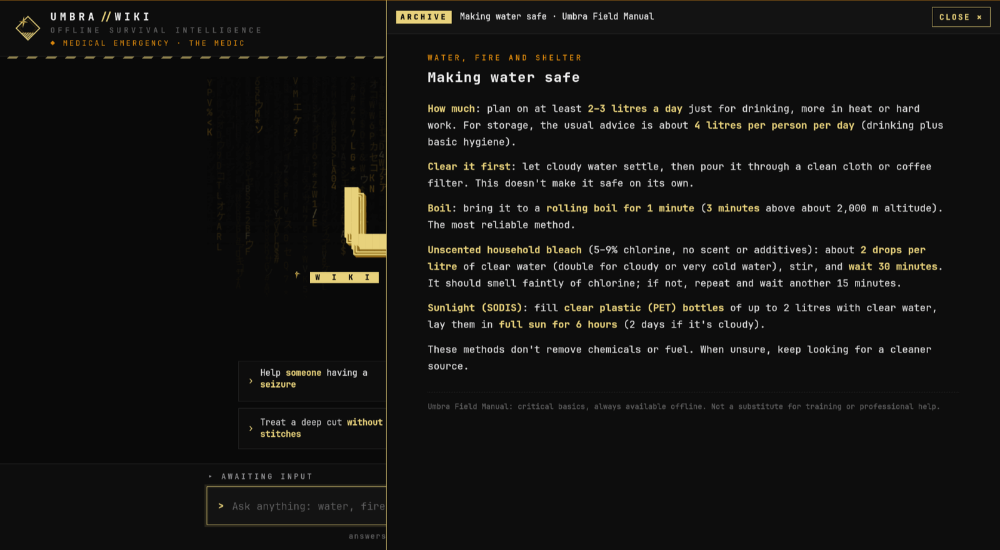

### A library you can grow

Pick a pack in the welcome tour or the Library panel (Survival Essentials
0.9 GB, Prepared 3.4 GB, or Complete 10.1 GB with all 19 collections), or
choose collections one by one: medicine, repair guides, gardening, off-grid
power, amateur radio, wilderness skills and more. Downloads run in the
background, are checked for damage, and join the library as they arrive.

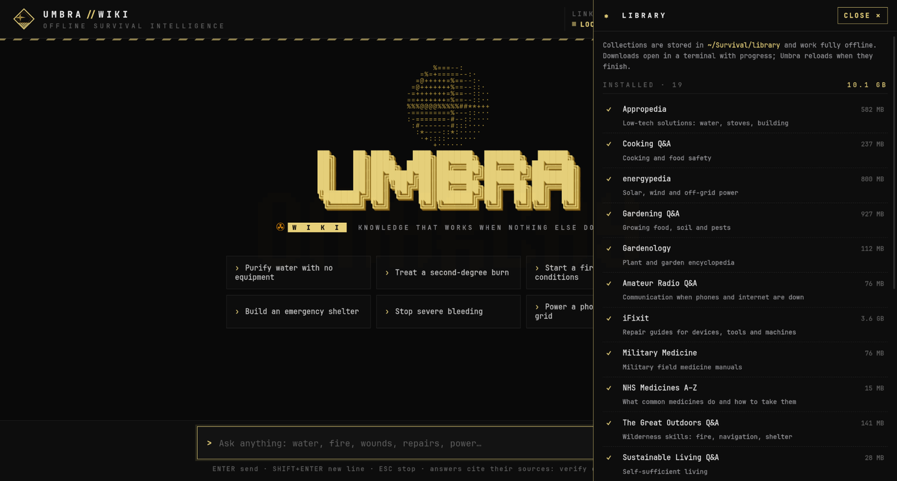

### Local first, online when you choose

Umbra is fully offline by default. When you have internet, switch **LINK** to
**ONLINE** and it adds Wikipedia for fuller, more current answers, and tells
you which facts came from where. It always asks first, and every launch starts
local.

### Loadout: scenarios and personalities

A **scenario** tells Umbra the situation you're in: Everyday Prep, Wilderness,
Grid Down, Natural Disaster, Medical Emergency and Wasteland, plus Homestead,
Workshop, Code Dojo, Study Hall and Campfire Tales for learning, fixing and
fun. A **personality** sets how it talks: Umbra itself, the Sergeant, the
Medic, the Old-Timer, Marcus Aurelius, Shackleton, Sherlock Holmes and more.
You can create your own of both.

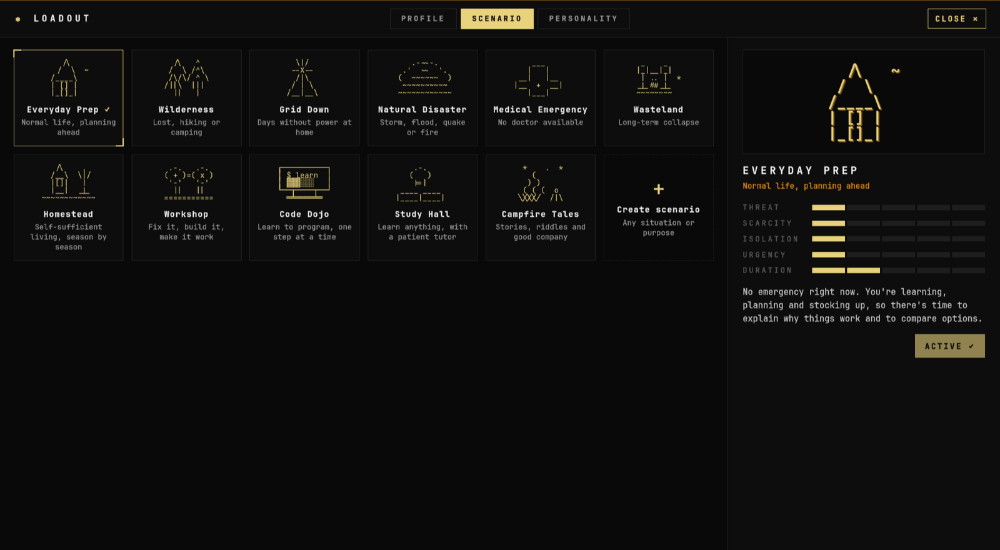
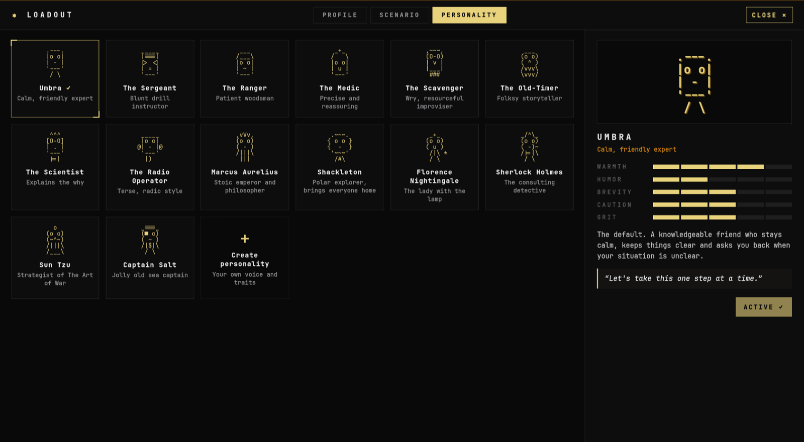

### Your profile

Your name and callsign, a few lines about you, a picture and an ASCII
character you build yourself, in framed sections with small ASCII animations
and a live **dog tag** that shows what you've filled in, with a completeness
meter. Umbra greets you by name, picks up from your last conversation, and
suggests questions that fit you. To **tailor the answers**, tell it where
you are (region and climate), your units, your experience and the **skills**
you already have (first aid, radio, fire, mechanics…), your household and
an **emergency contact**, your **blood type, allergies and medication**
(Umbra never suggests what you're allergic to, and they go on your printable
ID card). Pick a colour for your name in the chat, and see your **service
record**: rank, questions asked, best streak, favourite topic, and up to five
pinned achievement badges. An optional password keeps the screen (and the
Vault) private.

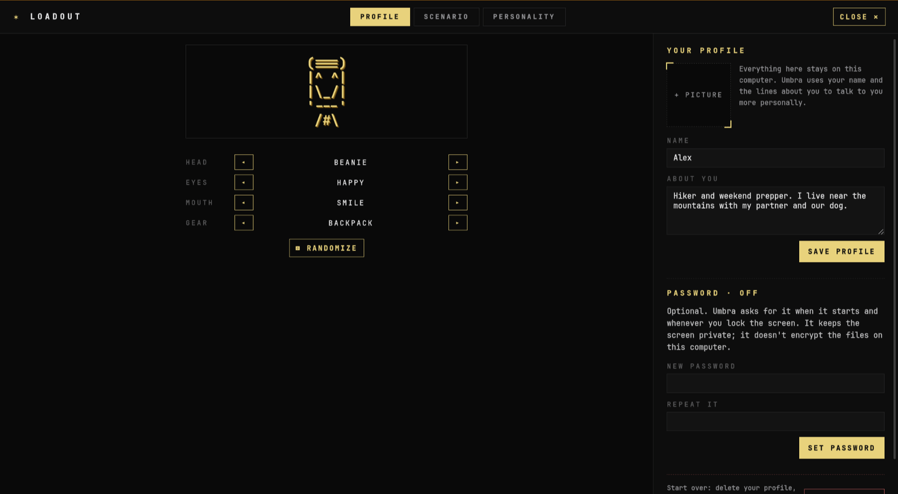
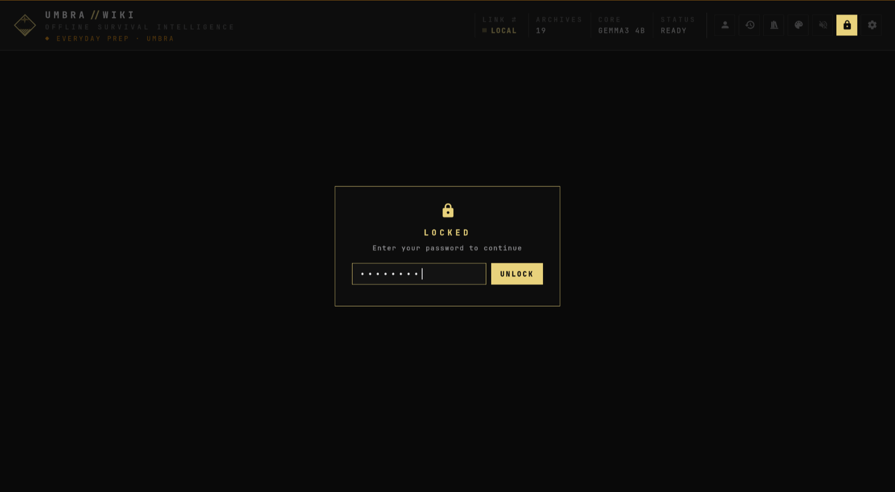

### Achievements

58 achievements in four tiers (bronze, silver, gold and legendary), each with
its own badge, in the Loadout's **ACHIEVEMENTS** tab: your first question and
the welcome tour, 10 to 500 questions, the ten survival topics (water, fire,
shelter, first aid, food, navigation, power, radio, repairs, disasters),
reading the whole field manual, a full library, off-grid answers, backups to
a USB stick, day streaks, maps and waypoints, the Field Kit, trying themes and personalities, creating your own,
and a few secret ones. Progress bars show how far along you are; a chime and
a pop-up celebrate each new one. Points raise your rank from Recruit to
Legend.

Earned achievements are kept for good: deleting conversations doesn't take
them away, updates keep them, and backups include them. Only Reset and
Uninstall remove them. After updating from an earlier version, Umbra counts
your saved conversations once, so earlier use counts too.

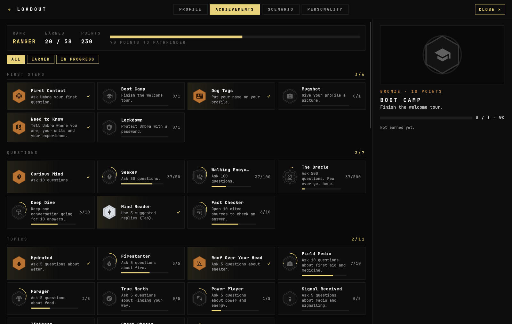

### Maps

A map tab (Ctrl+G) with **OpenStreetMap** maps that work offline, drawn by
Umbra in two styles: **Topographic**, in the colours of a military paper map
(blue water, green woods, brown relief and contour lines, red main roads,
dark buildings, dash-dot borders, a degree collar), and **Tactical**, dark and
in your Umbra theme. It goes from the whole world down to single streets,
and moves smoothly: tiles are drawn once in the background and then only
slid and scaled.

- **Download any area:** a country from the list, or simply the area on
  screen. Umbra first checks the exact size, then fetches only that area
  from the daily OpenStreetMap build: never the whole planet. Choose the
  detail (towns and roads, streets and paths, or everything), **relief and
  contour lines** (elevation data), and **Essentials**: every drinking-water
  tap, spring, shelter, pharmacy, hospital, toilet and fuel station, kept
  small on disk. A city takes a few megabytes; the Netherlands with every
  street is about 0.8 GB.
- **Search** towns, streets, water and places across every downloaded map,
  nearest first (try "drinking water"), or type coordinates the way the map
  shows them (`52.0907° N 5.1214° E`, `N52.09 E5.12`, `52.09, 5.12`,
  `52°5'26"N 5°7'17"E`) or an MGRS reference (`31U FT 45332 73249`). Every
  place card has a **COPY** button for its coordinates.
- **Country files:** every country's name can be clicked. The camera centres
  on it, its outline lights up and a dark data window glitches in, tied to
  the country by a pointed line: the flag, an ASCII drawing of the country,
  the capital and main cities with coordinates and MGRS, languages,
  population, currency, time zone, climate, terrain, resources, hazards,
  neighbours, drinking water and doctors (from the CIA World Factbook).
- **Safety levels of your own:** mark countries safe, caution, avoid or
  danger in their file, and the map colours them at every zoom, with a key
  (the shield button turns the layer on and off).
- **Pause and resume** a download any time, even across a restart; it goes
  on from where it stopped. Downloaded areas and waypoints are listed (in the
  map and in Settings → Your data) and removable one by one.
- A lat/long grid, the **MGRS grid zones**, a live readout in degrees and
  MGRS, a scale bar and compass; **waypoints** with notes, **distance
  measuring**, **ASK UMBRA** about a place, and **full screen** (F).

A small world map is built in, so the tab works before any download. Maps
you download are yours only: they're stored in your own data folder and
never part of an update or of someone else's install. Every button has a
tooltip that says what it does.

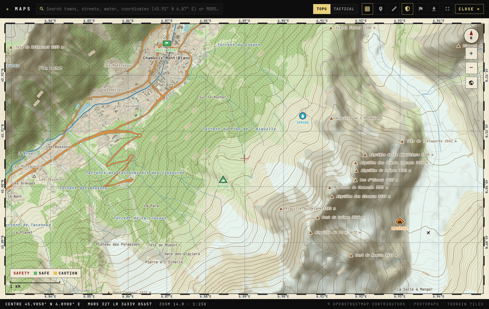
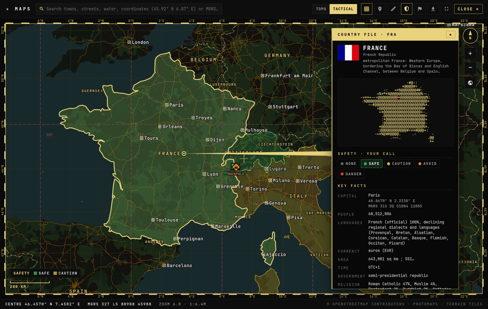

### Field Kit

The tools that can matter between life and death, all offline (Ctrl+K):

- **Medic**, in five pages:
  - **Life support:** a **CPR metronome** (110 a minute, adult, child and
    infant guidance, 30:2 or hands-only, a 2-minute swap reminder),
    **first-aid timers** that keep running and ring, and a **pulse and
    breathing counter**.
  - **Assess:** **START triage** one question at a time with a casualty
    count, the **Glasgow Coma Scale**, AVPU, and normal vital signs by age.
  - **Calculate:** burn area by the **rule of nines** (adult and child) with
    **Parkland** fluids, **child doses** of paracetamol and ibuprofen by
    weight (or age) in ml of the syrup on your bottle, **drip rate**, an
    **oral rehydration** recipe, and blood loss signs.
  - **Patient:** a body chart to mark bleeding, burns, fractures, wounds and
    pain, a **timed log** of observations and treatment, and handover reports
    ready to copy: **MIST** and a **9-line MEDEVAC** request.
  - **Guides:** anaphylaxis and auto-injectors, snakebite, heat and cold
    stages, splinting, eyes, wounds and teeth.
- **Sun & moon:** a live ASCII **Earth, Sun and Moon** at the top: day and
  night placed by the real position of the Sun, the Moon in its real
  direction and phase, your place marked, stars twinkling, a time-lapse.
  Then first light, sunrise and its direction, solar noon, sunset, last
  light, daylight left, and the moon's phase, rise and set, for the map's
  centre, a waypoint or any coordinates. Worked out on the computer.
- **Supplies:** your household (adults, children, infants, seniors, pets),
  climate and activity, and what you've stored: see how long water and food
  last, what runs out first, and how much more you need for your goal.
- **Vault:** a round vault door that opens with your lock password (or a
  click if you have none) on your arsenal: firearms, ammunition and defence
  gear, **valuables** and **data** (drives, backups, document copies), picked from a library of common models (pistols, revolvers, rifles,
  shotguns, bows, crossbows, knives, sprays) or entered by hand. Each has an
  **inspect view** with its ASCII drawing, parts called out, specifications,
  and the rounds you have for it. Stored on your computer only, behind the
  password (not encrypted).
- **Training:** **field manuals** to download and read (nine US Army field
  manuals, Sweden's civil-defence brochure, FEMA's preparedness guide),
  Morse by ear and by hand, a **Morse challenge** (key the
  word or sentence shown, for points and a streak), a **signal lamp**, the
  **NATO phonetic alphabet**, **radio procedure words**, **grid references**,
  **compass bearings and pace count**, **SALUTE reports** (with a form to
  fill in and copy), a daily drill, and eight knots step by step.
- **Pocket cards:** your **ID & medical card**, field manual pages, your
  waypoints with MGRS, your supplies, emergency contacts and notes, printed
  four to an A4 page to cut out; a sketch shows the page before you print.

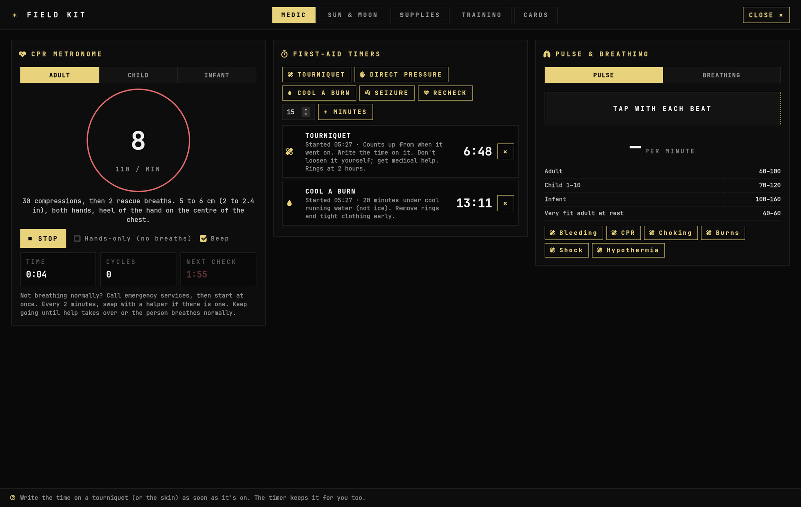

### Signals & Radar

A command-centre screen (Ctrl+J). In the middle, a sonar-style **radar** with
you at the centre: every Wi-Fi network and Bluetooth device the radios hear
is a blip, nearer the centre the stronger its signal, lit up as the sweep
passes. Click one for its file: type, strength and a rough distance,
channel and band, security, maker, address. Around it, your device's vitals
(processor, temperature, memory, battery, disk, network traffic) and the
Wi-Fi channels in use. It needs no internet, only the radios switched on, so
it works off the grid too. Passive: Umbra connects to nothing and keeps
nothing. INTEL sums up bands, security, makers and open networks, the EVENT
LOG records contacts appearing, leaving, closing in or fading, and the **kill
switch** turns Wi-Fi, mobile data and Bluetooth off at once (and back on).
Full screen with F.

### History, export and backup

Every conversation is saved on your computer. Reopen and continue any of
them, search through everything that was said, sort them into **folders**
(with a colour and a brief that Umbra keeps in mind for every conversation
in the folder), pin the ones you need, export conversations or the
field manual as plain files to your Documents folder or a USB stick, and back
up your whole Umbra (profile, settings, custom items, conversations) to one
file.

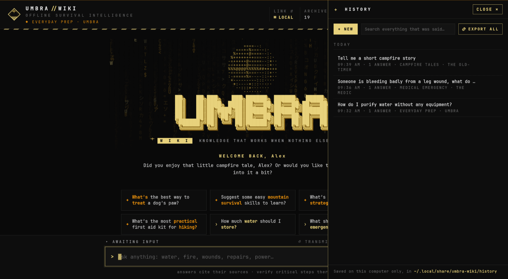

### Look and feel

22 themes, from Umbra's own matte black and signal yellow to Neon City,
Aurora Borealis, Imperium and Art Deco, plus a theme editor and one that
follows your Omarchy theme.

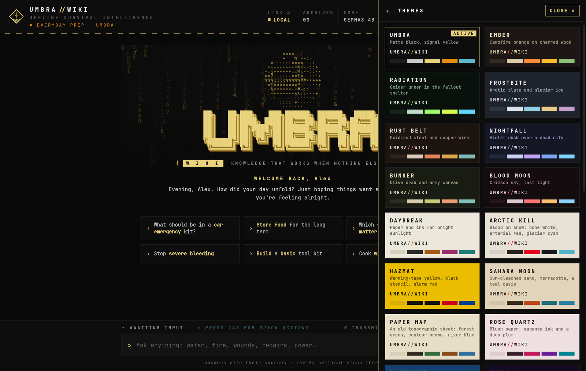

Nine animated start-screen backgrounds: digital rain, rising rain, Saturn
rings orbiting the globe, starfield, night forest, snowfall, northern lights,
campfire embers and a radar sweep.

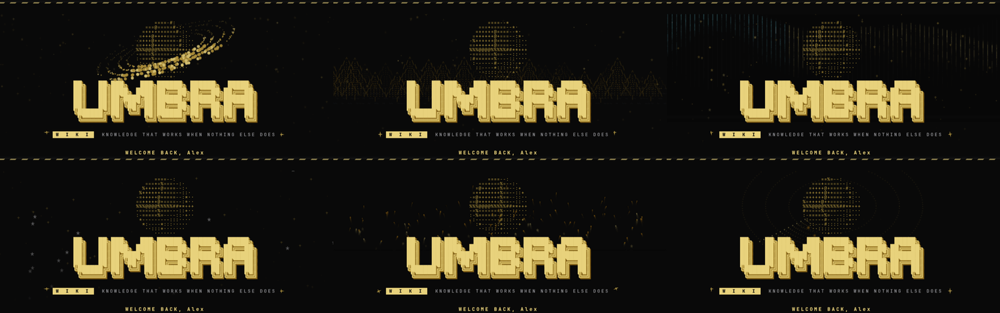

Every launch boots with **UMBRA // ONLINE**, a welcome by name and Umbra's
boot chime; closing asks first and signs off with **UMBRA // OFFLINE**. Eight
transition styles to choose from, with previews in Settings.

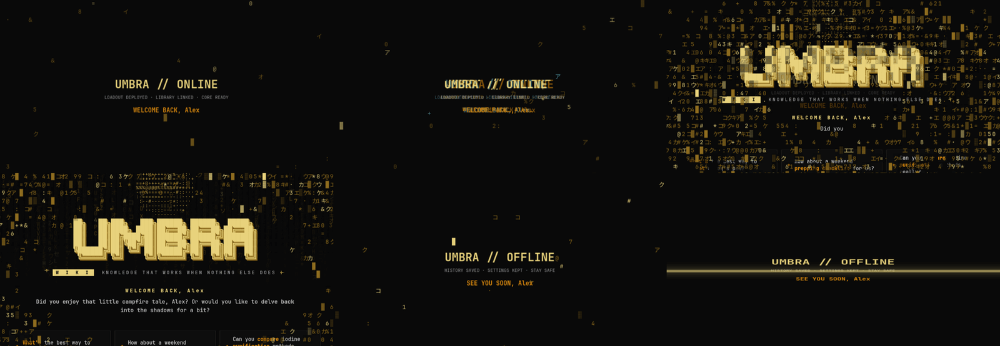

### Settings for how you use it

Settings are grouped in six categories, each with its own colour and a chip
under the search box to jump there: **Look & feel**, **Sound & voice**, **AI &
performance**, **Your data** (backups, downloaded maps and waypoints, where
things are kept), **Help & updates** (shortcuts, the tour, what's new,
updates) and the **Danger zone**. A **search box** at the top finds any setting as you type (Ctrl+F while
Settings is open), and points you to the right panel for things that live
elsewhere, like themes or your profile.

Then **Performance**: a live graph of your processor over the last
minute (and how much of it Umbra uses), a bar per processor thread, the
temperature and memory, and the **AI processor limit**: a four-step bar
(25, 50, 75 or 100%) that sets how many cores the AI may use while it writes,
to keep a laptop cooler and quieter.

Then text size, sound output and microphone, volume, which header buttons show,
transitions, backgrounds, reduced motion, the local AI model, voice input,
backups, and **off-grid mode**: a battery saver that calms the animations,
skips Umbra's extra AI work and keeps answers short, automatically when you
unplug if you like.

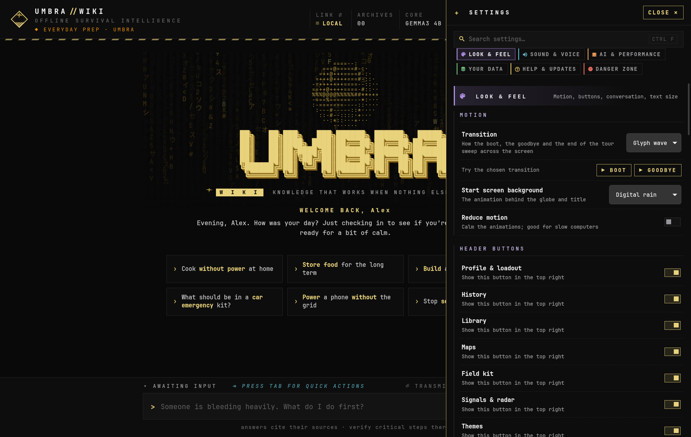

---

## The bar widget

Click the Umbra emblem in the Omarchy bar for Umbra at a glance: the spinning
globe, the model and library, quick **SOUND** and **OFF-GRID** switches, your
loadout, your latest conversations (click one to reopen it), the theme, your
coding agents (Claude Code, Codex and others) with their running sessions, and
an hourly field note. The emblem lights up in your theme's colour when an
answer is waiting in the background.

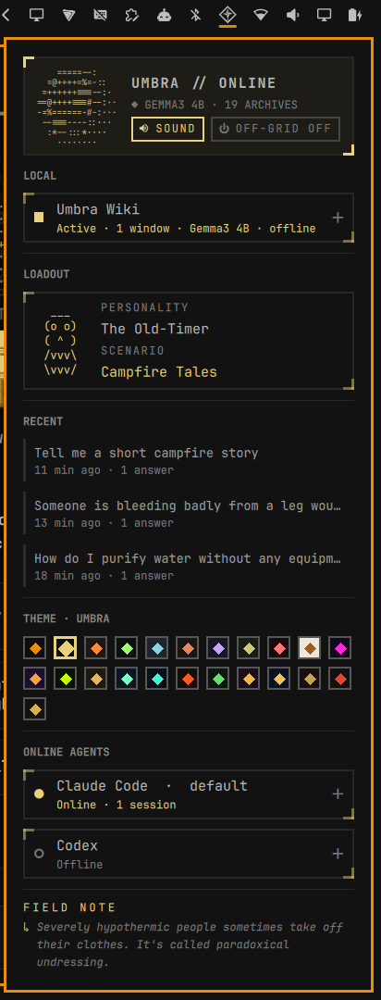

---

## Install

### On Omarchy

1. Install **Omarchy Umbra** from the Omarchy plugin marketplace. The Umbra
   emblem appears in your bar.
2. Click it, and under **LOCAL** click **Set up Umbra Wiki**. A terminal opens
   and asks for your password once. It installs Ollama and a few system
   packages (and the graphics-card build of Ollama if you have a supported
   NVIDIA or AMD card), installs the Umbra Wiki app, and offers voice input.
3. Umbra opens and its [welcome tour](#first-launch-the-welcome-tour) takes it
   from there.

### On Arch Linux (without Omarchy)

Umbra Wiki has its own signed pacman repository, **[umbra]**, so it installs
and updates like any other Arch software. Step-by-step guide with copy
buttons: **https://umbraxc.github.io/umbra-repo/**

```bash
# 1. Trust the Umbra signing key (once)
curl -sL https://umbraxc.github.io/umbra-repo/umbra.gpg | sudo pacman-key --add -
sudo pacman-key --lsign-key E50B101F98529A32564FDD3B37A6D2DA9E6A0F0B

# 2. Add the [umbra] repository to /etc/pacman.conf (once)
printf '\n[umbra]\nServer = https://umbraxc.github.io/umbra-repo/$arch\n' | sudo tee -a /etc/pacman.conf

# 3. Install Umbra Wiki and everything it needs
sudo pacman -Sy umbra-wiki

# 4. Start the local AI engine (once), then open Umbra
sudo systemctl enable --now ollama
umbra-wiki
```

Updates arrive with `sudo pacman -Syu`. Every package and the repository
index are signed; the key's fingerprint is
`E50B 101F 9852 9A32 564F DD3B 37A6 D2DA 9E6A 0F0B`.

For voice input, install [voxtype](https://voxtype.io) from the AUR
(`yay -S voxtype-bin && voxtype setup --download --model base.en`), then
hold **F9** in the Umbra window to talk.

Umbra Wiki will also be published to the **AUR** as `umbra-wiki` as soon as
AUR account registration reopens; the recipe is ready in
[`aur/PKGBUILD`](aur/PKGBUILD).

<details>
<summary>Just the package file, without adding the repository</summary>

```bash
curl -L -o umbra-wiki.pkg.tar.zst \
  https://github.com/umbraxc/omarchy-umbra/releases/latest/download/umbra-wiki-latest-any.pkg.tar.zst
sudo pacman -U umbra-wiki.pkg.tar.zst
```

Checksums are in each release's `SHA256SUMS`. Updates: repeat this when a
new release is out.
</details>

<details>
<summary>Build the package yourself</summary>

```bash
git clone https://github.com/umbraxc/omarchy-umbra.git
cd omarchy-umbra/aur && makepkg -si
```
</details>

<details>
<summary>From the repository, without a package</summary>

```bash
git clone https://github.com/umbraxc/omarchy-umbra.git ~/.local/share/omarchy-umbra
~/.local/share/omarchy-umbra/install-arch.sh
```

The installer does the same as the Omarchy setup and then opens Umbra. Keep
the cloned folder: Umbra runs from it. It sets up voice input too if you
have `yay` or `paru`.
</details>

To update a repository install, pull the new version, then reinstall:
`git -C ~/.local/share/omarchy-umbra pull` and
`~/.local/share/omarchy-umbra/install-arch.sh --update`.

### What gets installed

| | |
|---|---|
| System packages | `ollama`, `python-gobject`, `webkit2gtk-4.1`, `gst-plugins-good`, `kiwix-tools`, `jq`, `curl`, `pciutils`, `pipewire-audio`, `xdg-utils`, `libnotify`, `gtk-update-icon-cache`, `ttf-jetbrains-mono-nerd` (only if missing), `ollama-cuda` or `ollama-rocm` for supported cards |
| The app | a launcher (`~/.local/bin/umbra-wiki`), an app-menu entry and icon, and a background service (`umbra-wiki.service`, per user) |
| Chosen in the tour | an AI model (0.8 to 4.9 GB) and library packs (0.9 to 10.1 GB) |
| Optional | voice input: voxtype and its English speech model (about 0.2 GB) |

---

## First launch: the welcome tour

Umbra introduces itself and sets itself up with you, one step at a time: your
name and an optional password, what Umbra is for, the AI model (it looks at
your processor, memory and graphics card and recommends one), the library
packs, a theme, a scenario and a personality, text size, background and
off-grid mode, then a spotlight tour of every control. It runs once; replay
it any time from Settings.

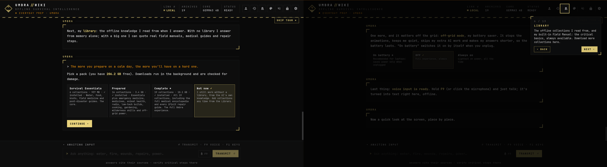

---

## Requirements and speed

- Arch Linux (Omarchy for the bar widget), with PipeWire or PulseAudio.
- 8 GB of memory or more for the recommended model; 4 GB works with the
  smallest.
- Disk space for the model and the library you choose (1 to 15 GB).

| Model | Download | Memory | What to expect |
|---|---|---|---|
| Gemma 3 · 1B | 0.8 GB | 4 GB | fastest, basic answers |
| Gemma 3 · 4B (recommended) | 3.3 GB | 8 GB | a good balance |
| Llama 3.1 · 8B | 4.9 GB | 16 GB | most capable, slow without a graphics card |

Everything runs on your own computer. On a typical laptop processor an
answer takes one to three minutes; a supported NVIDIA or AMD graphics card
makes it much faster. Off-grid mode shortens answers to save time and
battery.

Umbra Wiki speaks and understands English.

---

## Privacy and security

- **Nothing leaves your computer** in local mode: the AI, the library, your
  history and your settings are all on your disk. Online mode sends only
  your question's key words to Wikipedia, and only after you switch it on.
  Umbra goes online otherwise only when you ask it to: downloading the
  library, an AI model or maps (from the Protomaps OpenStreetMap build and
  the AWS Terrain Tiles), and checking for updates.
- Your data lives in `~/.config/umbra-wiki` (settings, profile) and
  `~/.local/share/umbra-wiki` (history, achievements, waypoints, maps). Exports and backups go to
  `~/Documents/Umbra` or the USB stick you choose.
- The **optional password** is stored only as a salted, slow hash. It keeps
  Umbra's screen private; it does not encrypt your files. Umbra's background
  service listens only on your own computer (127.0.0.1), where other
  programs you run can reach it, as with most local apps.

---

## Keyboard shortcuts

| Keys | Action |
|---|---|
| Enter / Shift+Enter | send / new line |
| Tab | quick actions (likely replies, tools, questions) |
| F9 | hold to talk |
| Esc | stop an answer, close a panel |
| Ctrl+Z / Ctrl+Y | undo / redo in the prompt |
| Ctrl+N | new conversation |
| Ctrl+H / Ctrl+F | history / search conversations |
| Ctrl+E | export this conversation |
| Ctrl+L | library and field manual |
| Ctrl+P / Ctrl+O | profile / loadout |
| Ctrl+G | maps (inside: / search, W waypoint, M measure, G grid, F full screen, + and − zoom) |
| Ctrl+K | field kit |
| Ctrl+J | signals & radar (S scans again) |
| Ctrl+T | themes |
| Ctrl+M | mute |
| Ctrl+, | settings |
| F1 | all shortcuts |

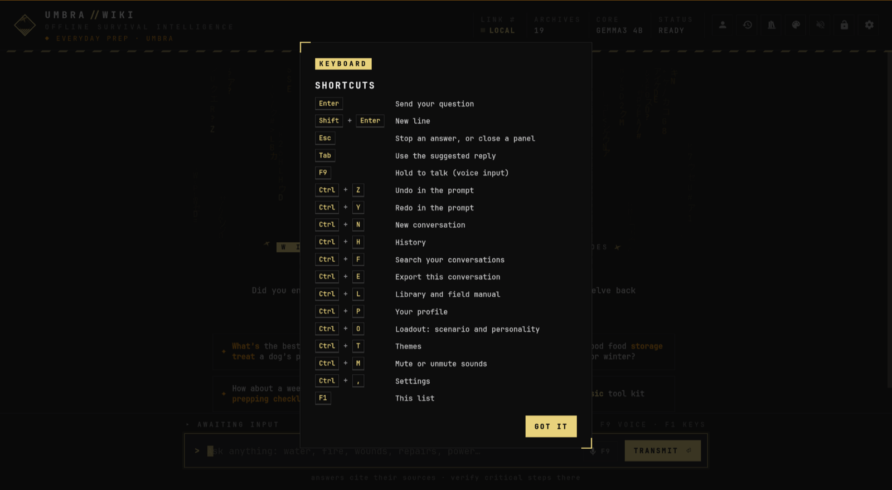

---

## Update, reset, uninstall

- **Downloads** (map areas, library collections, the AI model) show in a
  button at the top while they run: pause, resume or cancel each from there,
  or where you started it. They keep going in the background, carry on after
  a restart, and end with a chime and a note.
- **What's new**: the first time Umbra starts after an update, once it has
  booted and you've unlocked it, a short note shows what the update brought
  (once per version; again any time from Settings → Help & updates).

- **Check for updates**: Settings → Updates shows your version and asks
  GitHub for the newest release when you press CHECK NOW (the only time it
  goes online for this; nothing about you is sent), with the steps to update
  by hand for how your copy was installed.
- **Update**: on Omarchy, plugin updates arrive through Omarchy and Umbra
  picks them up; from the [umbra] repository, with `sudo pacman -Syu`; for a
  single package file, install the newest release the same way; for a
  repository clone, `git pull` the folder and run `install-arch.sh --update`. Your settings,
  history and library are never touched by updates.
- **Reset**: Settings → Danger zone → Reset Umbra starts over as if freshly
  installed (the tour runs again; profile, achievements and conversations are
  deleted); the AI model and library are kept.
- **Uninstall**: Settings → Danger zone → Uninstall Umbra removes the app,
  its service, settings and history, and optionally the library and the AI
  model. System packages stay, since other programs may use them. On
  Omarchy, remove the bar widget from Omarchy's plugin settings; for the
  Arch package, finish with `sudo pacman -R umbra-wiki`.

---

## Troubleshooting

| Problem | What to do |
|---|---|
| STATUS says NO MODEL | pick or download a model in Settings → AI model |
| STATUS says CORE OFFLINE | Ollama isn't running: `sudo systemctl enable --now ollama` |
| The window says the backend failed | `systemctl --user status umbra-wiki` and `journalctl --user -u umbra-wiki` |
| No sounds | see [No sound](#no-sound) below |
| Answers are slow | normal on a processor; try the 1B model or off-grid mode |
| Voice input missing | Omarchy: `omarchy-voxtype-install`; Arch: `yay -S voxtype-bin && voxtype setup --download --model base.en` |
| The CPU gets hot or loud while Umbra writes | Settings → Performance → lower the **AI processor limit** |

### No sound

Umbra plays its sounds with a small system program: `pw-play` (from
`pipewire-audio`) or, on PulseAudio systems, `paplay` (from `libpulse`). The
package lists them as optional, so a minimal Arch install may have neither,
and Umbra then stays silent. Go through these steps in order:

1. **Unmute Umbra.** The speaker button in the top right (or Settings → Sound →
   Sound effects) should be on, and the volume above zero.
2. **Look at Settings → Sound.** If it says *No sound player is installed*, it
   shows the exact command to run. Otherwise, run this check in a terminal
   while Umbra is open. It changes nothing and plays one beep:

   ```bash
   echo "players: $(command -v pw-play paplay | tr '\n' ' ')"; [ -S "$XDG_RUNTIME_DIR/pipewire-0" ] && echo "pipewire: yes" || echo "pipewire: no"; curl -s localhost:8766/api/settings | grep -o '"muted": *[a-z]*'; curl -s -X POST -H 'Content-Type: application/json' -d '{"name":"beep"}' localhost:8766/api/sound; echo
   ```

3. **Install a sound player** if `players:` is empty:

   | The check says | Run |
   |---|---|
   | `pipewire: yes` (most systems) | `sudo pacman -S --needed pipewire-audio` |
   | `pipewire: no` (PulseAudio) | `sudo pacman -S --needed libpulse` |

   Then press **▶ TEST** in Settings → Sound. No restart is needed.
4. **Choose the right speakers.** If `"muted": true` shows, turn Sound effects
   on. If a player is listed but you hear nothing, pick your speakers or
   headphones in Settings → Sound → Sound output and press ▶ TEST.
5. **Check the system volume** (for example with `wpctl status`, or your
   desktop's volume control). Other apps should be able to play sound too.
6. **Still silent?** Look at the backend log for errors:
   `journalctl --user -u umbra-wiki -n 50`, and open an
   [issue](https://github.com/umbraxc/omarchy-umbra/issues) with what the
   check printed.

---

## How it works

- **The bar widget** (`Panel.qml`, `agents.sh`) is an Omarchy shell plugin.
- **Umbra Wiki** (`umbra-wiki/`) is a small Python backend (`server.py`,
  standard library only) and a GTK + WebKit window (`umbra-wiki`) showing a
  local web interface (`ui/`). The backend runs `kiwix-serve` for the library,
  searches it and the field manual, and asks the model through Ollama's API.
- Downloads run in their own systemd units, verified against SHA-256
  checksums (`library.json`).

For development, a second instance with its own data runs next to your own:
`XDG_CONFIG_HOME=/tmp/u/c XDG_DATA_HOME=/tmp/u/d UMBRA_PORT=8866
UMBRA_KIWIX_PORT=8865 python3 umbra-wiki/server.py`, then
`UMBRA_PORT=8866 umbra-wiki --autotour` plays the welcome tour by itself.

---

## Safety

Umbra Wiki, its field manual and its answers are general information for
preparedness and emergencies. They are **not medical, legal or professional
advice** and not a substitute for training or emergency services. The AI can
make mistakes: check critical steps against the cited sources, and call your
local emergency number (112, 911, 999) whenever you can.

---

## Credits and license

Omarchy Umbra is released under the [MIT License](LICENSE). Sounds by
[Kenney](https://kenney.nl) (CC0). The offline library comes from
[Kiwix](https://kiwix.org) and [openZIM](https://openzim.org), each collection
under its publisher's license. AI models are downloaded through
[Ollama](https://ollama.com) under their makers' terms. The full list is in
[CREDITS.md](CREDITS.md).

Umbra was designed and directed by **umbraxc** and built together with
[Claude](https://claude.com), Anthropic's AI assistant.
