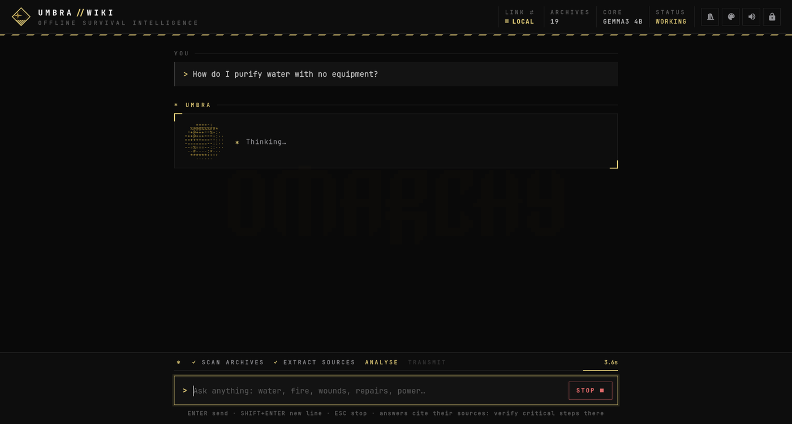
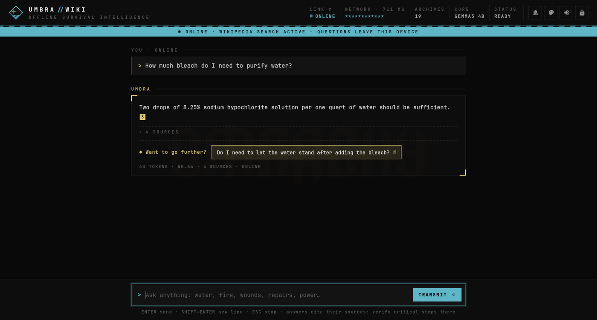
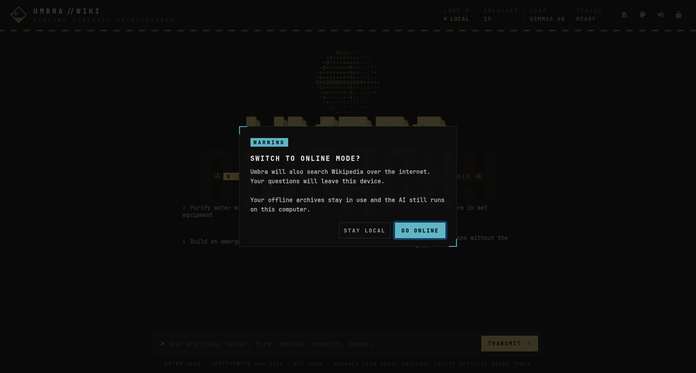
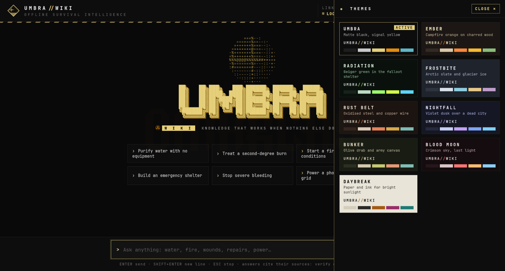

# Omarchy Umbra

An **agent tool for the Omarchy bar**. One icon gives you **Umbra Wiki**, an
offline survival AI that runs entirely on your computer, and the coding
agents you use online. See what's running, open anything with one click, and
theme it all.


## The bar widget


A bar icon, the Umbra emblem, that lights up while anything is running.
Click it for:

- **LOCAL**: **Umbra Wiki**, shown as **Ready** or **Active** with its open
  window count. Not installed yet? The entry reads **Set up Umbra Wiki** and
  starts a guided setup.
- **THEME**: one swatch per theme. Click one and an open Umbra Wiki window
  switches instantly; the panel's accent follows too.
- **ONLINE AGENTS**: every installed coding agent (Claude Code, Codex,
  OpenCode, Gemini and more), marked **Online** with its session count or
  **Offline**. Your default agent is labelled.

Click any entry to open it in a new window. Keyboard: `j`/`k` or the arrows
to move, Enter to open, `r` to refresh, Esc to close.

<br clear="right">

## Umbra Wiki

A question-and-answer assistant built for when there's no internet, no help
and no time to search. It feels like a conversation: you ask, it answers
from your offline library, cites its sources, and asks you back when your
situation isn't clear.

### Answers with sources


Umbra searches your archives, picks the passages that matter, and a local
AI model answers with numbered citations. **Hover a citation** for a short
summary of the article; **click it** to read the full article in a
side reader. Key actions are highlighted, and each answer ends with a
suggested next question.

Quantities, doses and times are only stated when they appear in the
sources: for anything medical or dangerous, the answer tells you to check
the source rather than guessing.

### While it works



A spinning ASCII globe and a live progress line (scan, extract, analyse,
transmit) show what's happening, with quiet scanner and sonar sounds. The
answer then types out smoothly as it's written.

### Local by default, online when you choose



Umbra always starts **LOCAL**: nothing leaves your computer. The **LINK**
switch adds Wikipedia search when you have a connection. Going online asks
for confirmation first, and online mode is unmistakable: the top bar turns a
different colour and a banner says questions leave the device. The network
name stays hidden behind stars until you hover it.



### Nine themes



**Umbra, Ember, Radiation, Frostbite, Rust Belt, Nightfall, Bunker, Blood
Moon** and **Daybreak**, a light theme for bright sunlight. Switch from the
theme button in Umbra Wiki or from the bar widget; the choice is saved.


### A library you can grow


The **Library** button lists the collections installed on your computer and
recommended ones you can add: medicine (WikiMed, WikEM, NHS Medicines),
repair (iFixit), energy, gardening, cooking, amateur radio and more.
Downloads resume if interrupted and are verified against their official
checksums before use.

### And the details

- **Lock**: freezes the window exactly where it is, with no scrolling,
  typing or clicking, until you unlock it with the same button.
- **Sounds**: very quiet ticks and tones for typing, searching, answers and
  switches, with a mute button.
- **Small-window friendly**: the header keeps what matters visible even at
  half-screen.


## Set up Umbra Wiki

Click **Set up Umbra Wiki** in the widget. A terminal walks you through:

1. installing Ollama and a few system packages (asks for your password)
2. choosing an AI model: `gemma3:4b` (recommended, 3.3 GB), `gemma3:1b`
   (fastest, 0.8 GB) or `llama3.1:8b` (most capable, 4.9 GB)
3. optionally downloading the **Survival Essentials** library (0.9 GB:
   water treatment, food preparation, knots, field and military medicine,
   post-disaster guides)
4. installing the Umbra Wiki app (launcher, app menu entry, icon and a
   background service)

Nothing is installed until you confirm. Your library goes to
`~/UmbraWiki/library` and your settings to `~/.config/umbra-wiki/`.

Speed depends on your computer: on a laptop without a GPU, expect the first
words after 15–40 seconds and a full answer in about a minute.

## Install

```bash
omarchy plugin add https://github.com/umbraxc/omarchy-umbra
omarchy bar put io.github.umbraxc.agent-launcher --before omarchy.network
```

The second command puts the icon just left of the Wi-Fi icon. Put it anywhere
you like with `omarchy bar move`.

## Uninstall

```bash
omarchy plugin remove io.github.umbraxc.agent-launcher
```

This disables the plugin, unloads it from the bar and deletes its folder. If
you set up Umbra Wiki, also remove what it installed in your home folder:

```bash
systemctl --user disable --now umbra-wiki
rm -f ~/.local/bin/umbra-wiki ~/.config/systemd/user/umbra-wiki.service \
  ~/.local/share/applications/org.umbra.wiki.desktop \
  ~/.local/share/icons/hicolor/scalable/apps/org.umbra.wiki.svg
rm -rf ~/.config/umbra-wiki ~/UmbraWiki      # your settings and library
```

Ollama and its models stay installed; remove them with
`omarchy pkg drop ollama` and `sudo rm -rf /var/lib/ollama` if you no longer
want them.

## Settings

| Key | Default | What it does |
|---|---|---|
| `pollIntervalMs` | `5000` | How often the running counts refresh |

```bash
omarchy bar set io.github.umbraxc.agent-launcher pollIntervalMs 10000 --json
```

Umbra Wiki's own settings live in `~/.config/umbra-wiki/config.json`
(`model`, `libraryDir`) and `settings.json` (`theme`, `muted`).

## How it works

- `Panel.qml` draws the bar icon and panel; `agents.sh` lists agents, opens
  them, switches themes and runs the guided setup.
- `umbra-wiki/` is the app:
  - `server.py`: a local backend on `127.0.0.1` that runs `kiwix-serve` over
    the library, finds the most relevant passages and streams the model's
    answer from Ollama
  - `ui/`: the interface (plain HTML, CSS and JavaScript; no network
    dependencies)
  - `umbra-wiki`: the native window (GTK + WebKit)
  - `install.sh`, `fetch-archive.sh` and `library.json`: installation,
    verified downloads and the collection catalog

## Requirements

- Omarchy with third-party bar-widget support
- Optional: coding agents for the ONLINE AGENTS section

Showing and opening entries needs no network access and never uses `sudo`.
Only **Set up Umbra Wiki**, after you confirm, installs packages (`ollama`,
`python-gobject`, `webkit2gtk-4.1`, `gst-plugins-good`, `kiwix-tools`) with
your password and downloads the model and library you choose. Umbra Wiki
listens only on `127.0.0.1`; in LOCAL mode nothing leaves your computer.

## Credits

Library collections are published by their respective projects and
distributed by [Kiwix](https://kiwix.org). AI models run through
[Ollama](https://ollama.com) under their own licenses. Umbra Wiki is not a
substitute for professional medical care or training.

## License

MIT
