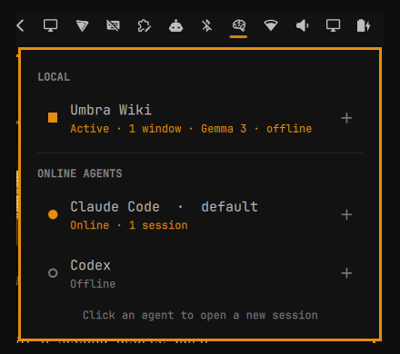

# Omarchy Umbra Agent Tool

An Omarchy bar widget for all your AI in one place: on-device AI you can use
offline, and the coding agents you run online. See what's running and open a
new session with one click.



## Features

- A bar icon that lights up while anything is running and dims when nothing
  is. Hover it for the number of running sessions.
- Left click opens a panel with two sections:
  - **LOCAL**: AI that runs on this computer. Your own local AI apps (added in
    settings), plus every installed [Ollama](https://ollama.com) model. Each
    shows **Ready**, or **Active** with its window or session count.
  - **ONLINE AGENTS**: every installed coding agent, marked **Online** (with
    its session count) or **Offline**. Your default agent is labelled.
- Click any entry to open it in a new window: coding agents and Ollama models
  in a terminal, local apps as their own app.
- **No local AI yet?** The LOCAL section offers **Set up a local AI**: a
  guided setup in a terminal that installs Ollama, lets you pick a model
  (small, recommended or large, with download sizes) and downloads it. Nothing
  is installed until you confirm.
- Keyboard: `j`/`k` or the arrow keys to move, Enter to open, `r` to refresh,
  Esc to close. Middle click on the icon refreshes; otherwise it refreshes
  every 5 seconds.

Coding agents open exactly the way `omarchy agent` opens them: the same
unattended flags, the same `org.omarchy.agent` window class (so your window
rules still apply), and starting in `~/Work` when that directory exists.

## Supported online agents

Claude Code, Codex, OpenCode, Gemini, Cursor CLI, GitHub Copilot, Crush, Grok,
Pi, Oh My Pi, Hermes and Muse Code — the same agents
`omarchy default agent` offers.

Only agents that are actually installed are listed. Omarchy puts
install-on-first-run stubs in `~/.local/bin` for every agent it offers; the
widget recognises those and hides them until the agent is really installed.

## Install

```bash
omarchy plugin add https://github.com/umbraxc/omarchy-umbra-agent-tool
omarchy bar put io.github.umbraxc.agent-launcher --before omarchy.network
```

The second command puts the icon just left of the Wi-Fi icon. Put it anywhere
you like with `omarchy bar move`.

## Uninstall

```bash
omarchy plugin remove io.github.umbraxc.agent-launcher
```

This disables the plugin, unloads it from the bar and deletes its folder. The
widget itself writes no files anywhere else. If you used **Set up a local
AI**, Ollama and its models stay installed; remove them with
`omarchy pkg drop ollama` and `rm -rf ~/.ollama /var/lib/ollama` (the
latter needs `sudo`) if you no longer want them.

## Settings

| Key | Default | What it does |
|---|---|---|
| `pollIntervalMs` | `5000` | How often the running counts refresh |
| `showOllamaModels` | `true` | List installed Ollama models under LOCAL |
| `localApps` | `[]` | Your own local AI apps to list under LOCAL |

```bash
omarchy bar set io.github.umbraxc.agent-launcher pollIntervalMs 10000 --json
omarchy bar set io.github.umbraxc.agent-launcher showOllamaModels false --json
```

### Adding your own local AI app

Add an entry to `localApps` in the widget's block in
`~/.config/omarchy/shell.json`. For example, an app started with the command
`umbra-wiki`:

```json
"localApps": [
  {
    "id": "umbra-wiki",
    "name": "Umbra Wiki",
    "command": "umbra-wiki",
    "process": "umbra-wiki",
    "description": "Gemma 3 · offline"
  }
]
```

- `command`: what to run when the entry is clicked. The entry only appears
  while this command is installed.
- `process`: the program name to count open windows by (defaults to the
  command). Programs run through `python`, `node` or `bun` are matched by
  their script name.
- `description`: a short line shown under the name.

## How it works

`Panel.qml` draws the bar icon and panel. `agents.sh` does the rest:

- `agents.sh status` prints one JSON line per entry (section, name, running
  count), found by matching process names and asking the local Ollama service
  for its models.
- `agents.sh launch <id>` opens a coding agent or Ollama model through
  `omarchy-launch-tui`; `agents.sh launch-app <command>` starts a local app.
- `agents.sh setup-local` is the guided local AI setup.

## Requirements

- Omarchy shell with third-party bar-widget support
- Optional: coding agents and/or Ollama. Without either, the panel offers the
  guided setup.

Showing and opening entries uses only tools every Omarchy system has (`bash`,
`ps`, `awk`, `jq`, `curl`, `gum`) plus Omarchy's own commands. It needs no
network access and never uses `sudo`. Only **Set up a local AI**, after you
confirm it, installs the `ollama` package (asking for your password) and
downloads a model from ollama.com.

## License

MIT
